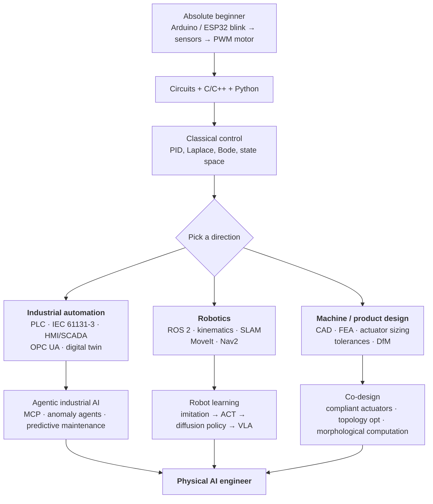
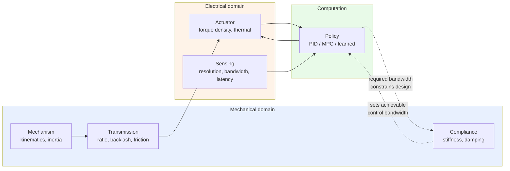
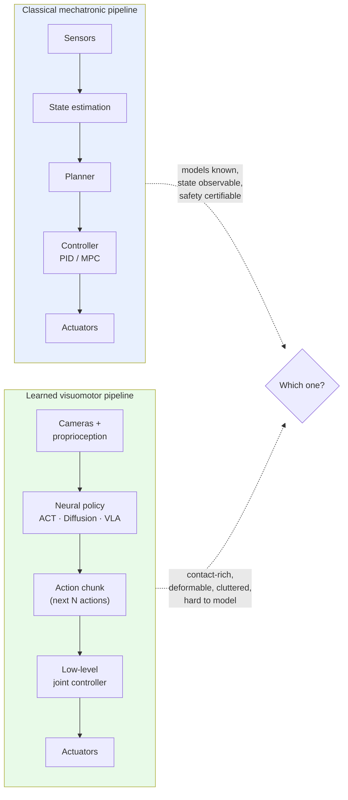
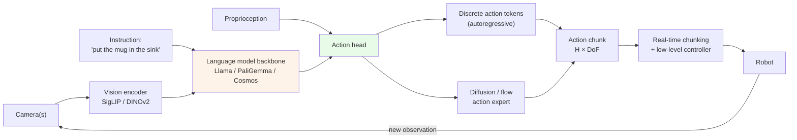
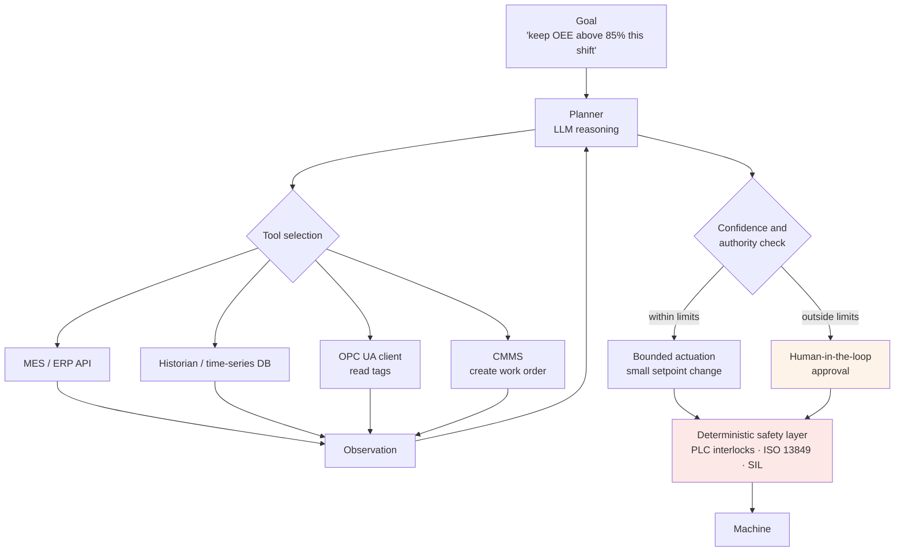

# Awesome Mechatronics with stars

<!-- Alternative header image — the classic mechatronics Venn diagram.
     Re-enable by uncommenting the block below.

  

-->

  <em>Books, courses, tools, papers and hardware for mechatronic engineering — from the classical V-model to vision-language-action models.</em>

  <a href="#0-what-mechatronics-means-now">Definitions</a> ·
  <a href="#1-start-here-learning-paths">Learning paths</a> ·
  <a href="#7-learning-based-control-the-new-core">VLAs &amp; diffusion policies</a> ·
  <a href="#8-agentic-ai-in-automation-and-robotics">Agentic AI</a> ·
  <a href="#9-hands-on-projects">Projects</a> ·
  <a href="#12-trends-radar-2026">Trends radar</a>

  

***

> **Mechatronics** is the synergistic integration of mechanical engineering, electronics, control theory and computing in the design of products and processes. The 1969 Yaskawa coinage described *machines with electronics inside*. The discipline has since absorbed cyber-physical systems, digital twins, and — since roughly 2023 — learned, language-conditioned policies that replace hand-written control laws. See [§0](#0-what-mechatronics-means-now) for how the definition has moved.

**What's in here.** This list keeps the classical mechatronics canon (it still matters — nothing about foundation models repeals the Nyquist criterion) and adds the parts of the field that appeared in the last five years: learned visuomotor control, VLAs, diffusion and flow-matching policies, GPU physics, agentic industrial software, and the mechanical-design ideas that came back into fashion because learning made compliant hardware tractable.

**Legend** — 📖 book · 📄 paper · 🎓 course · 🔧 tool · 📝 write-up · 🧪 hands-on · 🆓 free / open source · 💵 paid · ⭐ start here if you're new · 🔬 research-level

<strong>Table of contents</strong>

* [0. What Mechatronics Means Now](#0-what-mechatronics-means-now)
* [1. Start Here: Learning Paths](#1-start-here-learning-paths)
* [2. Foundations: Books & Courses](#2-foundations-books--courses)
* [3. The Mechanical Side, Seen From Mechatronics](#3-the-mechanical-side-seen-from-mechatronics)
* [4. Electronics, Embedded & Edge](#4-electronics-embedded--edge)
* [5. Industrial Automation, Industry 4.0 / 5.0](#5-industrial-automation-industry-40--50)
* [6. The Robotics Software Stack](#6-the-robotics-software-stack)
* [7. Learning-Based Control: The New Core](#7-learning-based-control-the-new-core)
* [8. Agentic AI in Automation and Robotics](#8-agentic-ai-in-automation-and-robotics)
* [9. Hands-On Projects](#9-hands-on-projects)
* [10. Hardware You Can Actually Buy or Build](#10-hardware-you-can-actually-buy-or-build)
* [11. Classic Mechatronic Systems](#11-classic-mechatronic-systems)
* [12. Trends Radar 2026](#12-trends-radar-2026)
* [13. Journals, Conferences, Communities](#13-journals-conferences-communities)
* [14. Related Awesome Lists](#14-related-awesome-lists)
* [Contributing](#contributing)
* [Licence](#licence)

***

## 0. What Mechatronics Means Now

### The definition has moved four times

Mechatronics has been redefined roughly once per industrial revolution, and the current redefinition is the sharpest since the 1990s.

  

**1. Mechanics + electronics → synergistic integration.** The 1980s–90s reframing was that mechatronics is not a sum of parts bolted together but a *co-design* discipline: the mechanism, the sensor choice and the control law are decided together, from the first sketch. This is where the V-model and concurrent engineering come from, and it remains the core professional skill.

**2. Mechatronics → Cyber-Physical Systems.** With Industry 4.0 (2011), production systems became networked CPS built on digital twins and standardised information models. Mechatronics stopped being about *one* machine and started being about fleets of machines with an information layer. The Asset Administration Shell (IEC 63278-1:2023) is the concrete artefact of this shift.

**3. CPS → Human-CPS (Industry 5.0).** From around 2020, the framing added human-centricity, resilience and sustainability, giving rise to *Human* Cyber-Physical Systems and cobots. A useful consequence: three industrial paradigms now coexist on the same shop floor, and a mechatronics engineer is expected to work across all three.

**4. Everything → Physical AI / Embodied AI.** The 2024–2026 shift is the largest. Perception-to-action neural policies increasingly *replace* the hand-designed controller, not just augment it. Terminology is genuinely contested here:

| Term             | Rough meaning                                                                                            | Who pushes it                                                            |
| ---------------- | -------------------------------------------------------------------------------------------------------- | ------------------------------------------------------------------------ |
| **Embodied AI**  | AI that perceives, decides and acts through a body (physical *or* simulated). The older, academic term.  | Academia; ITU-T Rec. **F.748.66** (Dec 2025) gives it a formal framework |
| **Physical AI**  | The broader commercial umbrella: models + simulation + compute sold as one stack for real-world machines | NVIDIA, BCG, investors                                                   |
| **Mechatronics** | The engineering discipline that actually builds the body the AI acts through                             | Everyone, once the demo has to ship                                      |

The honest reading: *Physical AI is a market category; mechatronics is the engineering discipline it depends on.* Nothing in a VLA solves backlash, thermal derating, or the fact that a harmonic drive has a torque ripple signature. What has changed is where the difficulty sits — less in writing the controller, more in **hardware that is learnable**: backdrivable, well-instrumented, repeatable, and cheap enough to collect thousands of demonstrations on.

### A working definition for 2026

> Mechatronics is the design of systems whose behaviour emerges from the co-design of mechanism, actuation, sensing, computation and *learned or programmed policy* — where the policy may now be a neural network trained on data rather than a control law derived from a model.

### Read the definition debate yourself 📄

* [The Evolution of Mechatronics Engineering and Its Relationship with Industry 3.0, 4.0, and 5.0](https://doi.org/10.3390/technologies14020081) — *Technologies*, 2026. 🆓 The single best recent paper on this question; proposes a generational classification of machines. **Start here.** ⭐
* [Mechatronics in Industry 4.0 and 5.0: advancing synergy, innovations, sustainability, and challenges](https://www.researchgate.net/publication/390078056) — Maki K. Habib, 2025.
* [Skills for Physical Artificial Intelligence](https://www.nature.com/articles/s42256-020-0177-2) — Miriyev & Kovač, *Nature Machine Intelligence*, 2020. 📄 The paper that named the skills gap between materials, mechanics and AI.
* [Intelligence as Computation](https://arxiv.org/abs/2412.14701) — Oliver Brock, 2024. 🔬 Argues digital, analog, mechanical and morphological computation are one continuum — the philosophical backbone for "mechanical intelligence."
* [ITU-T F.748.66](https://www.itu.int/rec/T-REC-F.748.66) — *Requirements and framework for embodied artificial intelligence systems*, approved Dec 2025. The first ITU-level attempt to standardise what "embodied AI system" means.
* [Evolution from mechatronics to cyber-physical systems: an educational point of view](https://www.researchgate.net/publication/306300681) — still the clearest statement of the CPS transition for curricula.

***

## 1. Start Here: Learning Paths

Mechatronics is wide enough that "where do I start" is the most common question. Three paths, depending on where you want to end up.

### Path A — Beginner, hands-on first (0–6 months) ⭐

You want to build something that moves before you learn Laplace transforms. This is a legitimate order.

1. **Get a board and a motor.** Arduino Uno/ESP32 + L298N or a TB6612 + a cheap DC gearmotor with an encoder. Total cost under €40.
2. 🎓 [Paul McWhorter — Arduino for Beginners](https://www.youtube.com/@paulmcwhorter) 🆓 — the most patient beginner series that exists.
3. 🎓 [ControlSystemsAcademy / Brian Douglas — Control System Lectures](https://www.youtube.com/@BrianBDouglas) 🆓 — intuition before mathematics. Watch "PID Control — A brief introduction" and the root locus series.
4. 🧪 Build a **closed-loop position controller** for one motor. Tune a PID by hand. This single project teaches sampling, quantisation, saturation, integral windup and derivative noise — the four things that actually bite in practice.
5. 🎓 [MATLAB Tech Talks — Understanding PID Control](https://www.mathworks.com/videos/series/understanding-pid-control.html) 🆓 (free videos even without a MATLAB licence)
6. Move to **ESP32 + micro-ROS** or **Raspberry Pi + ROS 2** and you're in the robotics world proper.
7. 🧪 Then: [LeRobot + an SO-101 arm](#78-hands-on-train-your-own-policy-) — collect 50 demonstrations, train a policy, watch it work. Two hours, and it will reframe everything you thought robot programming was.

### Path B — Undergraduate / career-switcher (6–18 months)

1. **Control**: 🎓 [Steve Brunton — Control Bootcamp](https://www.youtube.com/playlist?list=PLMrJAkhIeNNR20Mz-VpzgfQs5zrYi085m) 🆓 + 📖 [Feedback Systems](https://fbswiki.org/) (Åström & Murray) 🆓
2. **Robotics**: 📖 [Modern Robotics](http://hades.mech.northwestern.edu/index.php/Modern_Robotics) (Lynch & Park) 🆓 + the [Coursera specialisation](https://www.coursera.org/specializations/modernrobotics)
3. **Embedded**: build one project in bare-metal C on an STM32, then one on Zephyr RTOS. The contrast teaches you what an RTOS buys you.
4. **Industrial**: one PLC project in Structured Text on [OpenPLC](https://autonomylogic.com/) 🆓 or a real S7-1200, plus one OPC UA client.
5. **Learning**: 📖 [Robot Learning: A Tutorial](https://arxiv.org/abs/2510.12403) 🆓 — the single best on-ramp from classical control to learned policies, with runnable `lerobot` examples.

### Path C — Graduate / research 🔬

1. 📖 [Underactuated Robotics](https://underactuated.mit.edu/) and [Robotic Manipulation](https://manipulation.mit.edu/) — Russ Tedrake, MIT. 🆓 Free, interactive, with Drake notebooks. The best treatment anywhere of *why* contact-rich control is hard.
2. 📄 [Towards a Unified Understanding of Robot Manipulation: A Comprehensive Survey](https://arxiv.org/abs/2510.10903) — 2025. The map of the whole manipulation literature.
3. 📄 [Vision-Language-Action Models for Robotics: A Review Towards Real-World Applications](https://vla-survey.github.io/) — Kawaharazuka et al., *IEEE Access* 2025. Has a searchable database of every VLA.
4. Pick a benchmark ([LIBERO](https://libero-project.github.io/), [SimplerEnv](https://github.com/simpler-env/SimplerEnv) ⭐ 1,146 | 🐛 33 | 🌐 Jupyter Notebook | 📅 2025-12-20, [RoboCasa](https://robocasa.ai/)) and reproduce one result before you propose anything.

***

## 2. Foundations: Books & Courses

### Core mechatronics textbooks 📖

The classics, kept because they are still the right first books:

* [Mechatronics: Electronic Control Systems in Mechanical and Electrical Engineering](https://www.amazon.com/Mechatronics-Electronic-Mechanical-Electrical-Engineering/dp/1292076682) — W. Bolton, 7th ed. 💵 The standard undergraduate entry point.
* [Introduction to Mechatronics and Measurement Systems](https://www.amazon.com/Introduction-Mechatronics-Measurement-Systems-Alciatore/dp/1259892344) — Alciatore & Histand, 5th ed. 💵 Stronger on instrumentation and signal conditioning than Bolton.
* [The Mechatronics Handbook](http://www.sze.hu/~szenasy/Szenzorok%20%E9s%20aktu%E1torok/Szenzakt%20jegyzetek/Mechatronics_handbook%5B1%5D.pdf) — Robert H. Bishop (ed.). 🆓 first-edition PDF. Reference work, not a textbook.
* [Mechatronic Systems: Modelling and Simulation with HDLs](https://www.amazon.com/Mechatronic-Systems-Modelling-Simulation-HDLs/dp/0470849797) — Pelz. 💵 Underrated: HDL-based modelling of mixed-domain systems.
* [Control of Mechatronic Systems](https://www.wiley.com/en-us/Control+of+Mechatronic+Systems-p-9781119505792) — Patrick O. J. Kaltjob, 2021. 💵 One of the few recent books that treats digital control implementation seriously.
* [Machine Vision and Mechatronics in Practice](https://www.amazon.com/Machine-Vision-Mechatronics-Practice-Billingsley/dp/3662455137) — Billingsley & Brett. 💵
* [Automotive Mechatronics](https://www.amazon.com/Automotive-Mechatronics-Electronics-Professional-Information/dp/3658039744) — Bosch Professional Automotive Information. 💵 The reference for automotive networking, ESP/ABS, and drivetrain electronics.

### Control & dynamics (free where possible) 📖

* [Feedback Systems: An Introduction for Scientists and Engineers](https://fbswiki.org/) — Åström & Murray, 2nd ed. 🆓 Free PDF. The best free control textbook.
* [Data-Driven Science and Engineering](https://www.databookuw.com/) — Brunton & Kutz, 2nd ed. 🆓 Free PDF + code. SVD, DMD, SINDy, MPC, RL, all with runnable examples.
* [Applied Nonlinear Control](https://www.amazon.com/Applied-Nonlinear-Control-Jean-Jacques-Slotine/dp/0130408905) — Slotine & Li. 💵 Still the reference for Lyapunov design and sliding mode.
* [Predictive Control for Linear and Hybrid Systems](https://www.cambridge.org/highereducation/books/predictive-control-for-linear-and-hybrid-systems/EF618BD7AFAF4D04B2044A0FD03D885A) — Borrelli, Bemporad, Morari, Cambridge 2017. 💵
* [Rigid Body Dynamics Algorithms](https://link.springer.com/book/10.1007/978-1-4899-7560-7) — Roy Featherstone. 💵 If you ever need to know *why* your dynamics library is fast.

### Robotics 📖

* [Modern Robotics: Mechanics, Planning, and Control](http://hades.mech.northwestern.edu/index.php/Modern_Robotics) — Lynch & Park. 🆓 Free PDF, free videos, free software library, matching Coursera specialisation. ⭐ **The best value in robotics education.**
* [Robotics: Modelling, Planning and Control](https://link.springer.com/book/10.1007/978-1-84628-642-1) — Siciliano, Sciavicco, Villani, Oriolo. 💵 The European standard text.
* [Springer Handbook of Robotics](https://link.springer.com/referencework/10.1007/978-3-319-32552-1) — Siciliano & Khatib (eds.), 2nd ed. 💵 2,300 pages; the field's encyclopedia.
* [Probabilistic Robotics](https://mitpress.mit.edu/9780262201629/probabilistic-robotics/) — Thrun, Burgard, Fox. 💵 Still the reference for state estimation and SLAM.
* [Underactuated Robotics](https://underactuated.mit.edu/) — Russ Tedrake, MIT 6.832. 🆓 Free, interactive, updated every year. 🔬
* [Robotic Manipulation](https://manipulation.mit.edu/) — Russ Tedrake, MIT 6.4210. 🆓 Perception, planning and control for manipulation, with Drake.
* [Introduction to Autonomous Mobile Robots](https://mitpress.mit.edu/9780262015356/) — Siegwart, Nourbakhsh, Scaramuzza. 💵

### Machine learning for engineers 📖

* [Deep Learning](https://www.deeplearningbook.org/) — Goodfellow, Bengio, Courville. 🆓 Now historical, but the maths chapters age well.
* [Dive into Deep Learning](https://d2l.ai/) — Zhang et al. 🆓 Interactive, PyTorch/JAX, actually current.
* [Reinforcement Learning: An Introduction](http://incompleteideas.net/book/the-book.html) — Sutton & Barto, 2nd ed. 🆓
* [Spinning Up in Deep RL](https://spinningup.openai.com/) — OpenAI. 🆓 The clearest practical RL introduction; algorithms implemented readably.
* [Probabilistic Machine Learning](https://probml.github.io/pml-book/) — Kevin Murphy. 🆓 Two volumes, free PDFs.
* [Computer Vision: Algorithms and Applications](https://szeliski.org/Book/) — Szeliski, 2nd ed. 🆓

### Courses worth your time 🎓

| Course                                                                                                           | Who                    | Cost     | Why                                                        |
| ---------------------------------------------------------------------------------------------------------------- | ---------------------- | -------- | ---------------------------------------------------------- |
| [Control Bootcamp](https://www.youtube.com/playlist?list=PLMrJAkhIeNNR20Mz-VpzgfQs5zrYi085m)                     | Steve Brunton, UW      | 🆓       | Best state-space introduction on YouTube                   |
| [Modern Robotics Specialization](https://www.coursera.org/specializations/modernrobotics)                        | Northwestern           | 🆓 audit | Screw theory done properly, with CoppeliaSim labs          |
| [Underactuated Robotics](https://underactuated.mit.edu/)                                                         | MIT                    | 🆓       | Trajectory optimisation, LQR trees, contact 🔬             |
| [Robotic Manipulation](https://manipulation.mit.edu/)                                                            | MIT                    | 🆓       | The manipulation course, with Drake notebooks 🔬           |
| [SLAM lectures](https://www.youtube.com/@CyrillStachniss)                                                        | Cyrill Stachniss, Bonn | 🆓       | The reference SLAM lecture series                          |
| [Sim-to-Real with the SO-101](https://docs.nvidia.com/learning/physical-ai/sim-to-real-so-101/latest/)           | NVIDIA                 | 🆓       | Full pipeline: Isaac Sim → Isaac Lab → GR00T → real arm 🧪 |
| [LeRobot docs & tutorials](https://huggingface.co/docs/lerobot)                                                  | Hugging Face           | 🆓       | Imitation learning and VLAs, hands-on, end to end ⭐        |
| [Introduction to Robotics CS223A](https://see.stanford.edu/Course/CS223A)                                        | Khatib, Stanford       | 🆓       | Classic; operational space control from the source         |
| [Learn 5 PLCs in a Day](https://www.udemy.com/course/nfi-plc-online-leaning/)                                    | Udemy                  | 💵       | Practical multi-vendor PLC exposure                        |
| [From Wire to PLC](https://www.udemy.com/course/from-wire-to-plc-a-to-z-compilation/)                            | Udemy                  | 💵       | Panel wiring → ladder → commissioning                      |
| [Wearable Robotics — Exoskeletons](https://www.udemy.com/course/wearable-robots-robotic-exoskeleton-lower-limb/) | Udemy                  | 💵       | Niche but well-made                                        |

***

## 3. The Mechanical Side, Seen From Mechatronics

The most common failure mode in modern mechatronics projects is a good policy on bad hardware. This section is the mechanical engineering that a mechatronic engineer specifically needs — not general machine design, but the subset where mechanics and control interact.

### The central idea: your mechanism is part of your controller

Three rules that follow, and that no amount of learning removes:

1. **Structural resonance caps your bandwidth.** A closed loop cannot be much faster than the first flexible mode of the structure it drives. Stiffness is a control-design parameter.
2. **Backlash is not a disturbance, it is a discontinuity.** It breaks gradient-based tuning, breaks learned policies trained in simulation, and shows up as limit cycles.
3. **Reflected inertia scales with gear ratio squared.** This is why quasi-direct-drive exists, and why highly geared arms cannot do impedance control well.

### 3.1 Actuation & transmission

* 📄 [Compact Gearboxes for Modern Robotics: A Review](https://www.frontiersin.org/articles/10.3389/frobt.2020.00103/full) — García et al., *Frontiers in Robotics and AI*, 2020. 🆓 **The best free survey of harmonic, cycloidal, planetary and novel drives, with efficiency and backdrivability compared.** ⭐
* 📄 [Quasi-Direct Drive Actuation for a Lightweight Hip Exoskeleton with High Backdrivability and High Bandwidth](https://arxiv.org/abs/2004.00467) — Yu et al. 🆓 The clearest worked example of QDD design trade-offs.
* 📄 [Cycloidal Quasi-Direct Drive Actuators with Learning-Based Torque Estimation](https://arxiv.org/abs/2410.16591) — 2024. 🆓 Where mechanical design and learning meet directly: use a network to recover torque a cheap transmission can't sense.
* 📄 [Variable Impedance Actuators: A Review](https://www.sciencedirect.com/science/article/pii/S0921889013001188) — Vanderborght et al. The taxonomy paper for SEA / VSA / PEA.
* 🔧 [SimpleFOC](https://simplefoc.com/) 🆓 — Field-oriented control on Arduino-class hardware. The fastest way to understand BLDC control by doing.
* 🔧 [ODrive](https://odriverobotics.com/) 💵 / 🔧 [moteus](https://mjbots.com/) 💵 — Open(ish) high-performance BLDC controllers used across the hobby-to-research spectrum.
* 🔧 [TMotor / CubeMars AK-series](https://www.cubemars.com/) 💵 — the de-facto QDD actuators for legged robot builds.

**Selection cheat-sheet:**

| Need                                 | Architecture             | Typical ratio | Trade-off                                  |
| ------------------------------------ | ------------------------ | ------------- | ------------------------------------------ |
| Precise position, high stiffness     | Harmonic / strain wave   | 50:1–160:1    | Non-backdrivable, expensive, torque ripple |
| High dynamics, force control, impact | Quasi-direct drive (QDD) | 6:1–10:1      | Large motor, high current, heat            |
| Safe human contact, energy storage   | Series elastic (SEA)     | any + spring  | Bandwidth limited by spring, extra sensing |
| Cheap, high ratio, tolerant          | Cycloidal                | 20:1–100:1    | Vibration, harder to manufacture well      |
| Lightweight distal mass              | Cable / tendon drive     | varies        | Friction, stretch, routing complexity      |

### 3.2 Compliance, contact and impedance

Learning-based manipulation made compliance fashionable again: policies that touch things need hardware that can survive touching things.

* 📄 [Series Elastic Actuators](https://ieeexplore.ieee.org/document/525827) — Pratt & Williamson, IROS 1995. The origin paper; still worth reading.
* 📄 [Backdrivable actuators in robotics](https://www.emergentmind.com/topics/backdrivable-actuators) — a good living survey of the design space.
* 📄 [Mechatronic whole-body co-design of a quadruped robot integrating local compliance](https://auctus-team.gitlabpages.inria.fr/jobs/2026/phd_quadruped/) — INRIA, 2026. States the current frontier plainly: rigid QDD quadrupeds have plateaued far below biological performance, and distributed compliance is the next lever.
* 🔧 [Drake](https://drake.mit.edu/) 🆓 — hydroelastic contact modelling; the reference implementation for contact-rich simulation you can trust.

### 3.3 Mechanical intelligence & morphological computation 🔬

The idea that the body itself performs computation — that a well-designed gripper needs less control than a badly-designed one. This has moved from curiosity to an active research programme.

* 📄 [Intelligence as Computation](https://arxiv.org/abs/2412.14701) — Oliver Brock, 2024. Unifies digital, analog, mechanical and morphological computation.
* 📄 [Perspectives on Intelligence in Soft Robotics](https://advanced.onlinelibrary.wiley.com/doi/10.1002/aisy.202400294) — Kortman et al., *Advanced Intelligent Systems*, 2025. 🆓 Classifies embodied intelligence into adaptive shape, adaptive functionality and adaptive mechanics.
* 📄 [Reprogrammable metamaterial robot with embodied versatile computation and mechanical intelligence](https://www.nature.com/articles/s41467-026-71368-1) — *Nature Communications*, 2026. 🆓 Elastic-wave metamaterials performing analog and logic operations inside a crawling robot.
* 📄 [The 2024 Active Metamaterials Roadmap](https://arxiv.org/abs/2411.09711) — 🆓 Shape-morphing metamaterials as embodied intelligence.
* 📄 [Exploring Embodied Intelligence in Soft Robotics: A Review](https://www.mdpi.com/2313-7673/9/4/248) — *Biomimetics*, 2024. 🆓
* 📄 [Morphological design methodologies of soft robots](https://www.the-innovation.org/article/doi/10.59717/j.xinn-inform.2025.100012) — 2025. 🆓 Forward biomimetic vs. inverse morphological design.

### 3.4 Design, simulation and manufacturing tools

| Tool                                                                                                                                                        | Type                     | Cost               | Note                                                                       |
| ----------------------------------------------------------------------------------------------------------------------------------------------------------- | ------------------------ | ------------------ | -------------------------------------------------------------------------- |
| [FreeCAD](https://www.freecad.org/)                                                                                                                         | Parametric CAD           | 🆓                 | v1.x finally fixed the topological naming problem; genuinely usable now    |
| [Onshape](https://www.onshape.com/)                                                                                                                         | Cloud CAD                | 🆓 free tier       | Free for public documents; excellent for open-source hardware              |
| [SolidWorks](https://www.solidworks.com/)                                                                                                                   | CAD + CAE                | 💵                 | Industry default; motion + FEA add-ins                                     |
| [Fusion](https://www.autodesk.com/products/fusion-360/)                                                                                                     | CAD/CAM/CAE              | 💵 (free personal) | Integrated generative design and CAM                                       |
| [nTop](https://www.ntop.com/)                                                                                                                               | Implicit modelling       | 💵                 | Lattices, topology optimisation, field-driven design                       |
| [Ansys](https://www.ansys.com/) / [COMSOL](https://www.comsol.com/)                                                                                         | Multiphysics FEA         | 💵                 | Thermal + structural + electromagnetic coupling                            |
| [CalculiX](https://www.calculix.de/) / [Code\_Aster](https://code-aster.org/)                                                                               | FEA solver               | 🆓                 | Free FEA; usable via FreeCAD FEM workbench                                 |
| [ToOptix](https://github.com/DerBaumeister/toOptix) / [ToPy](https://github.com/williamhunter/topy) ⭐ 573 \| 🐛 11 \| 🌐 Python \| 📅 2022-08-31            | Topology optimisation    | 🆓                 | Learn the method before paying for a suite                                 |
| [OpenModelica](https://openmodelica.org/)                                                                                                                   | Acausal multi-domain sim | 🆓                 | The right tool for mechanical+hydraulic+electrical system models           |
| [Simscape](https://www.mathworks.com/products/simscape.html)                                                                                                | Multi-domain sim         | 💵                 | The commercial equivalent, tightly coupled to Simulink                     |
| [Blender](https://www.blender.org/)                                                                                                                         | 3D modelling             | 🆓                 | Not CAD, but the standard for robot visual meshes and rendering            |
| [PrusaSlicer](https://www.prusa3d.com/prusaslicer/) / [OrcaSlicer](https://github.com/SoftFever/OrcaSlicer) ⭐ 15,471 \| 🐛 2,569 \| 🌐 C++ \| 📅 2026-08-24 | Slicers                  | 🆓                 | Printed robot parts: print orientation determines layer-direction strength |

### 3.5 Practical mechanical checklist for mechatronic builds 🧪

Expand — the things that actually go wrong

* **Actuator sizing:** size on RMS torque over the duty cycle, not peak. Check thermal, then check peak, then check backdrive torque.
* **Reflected inertia ratio:** aim for load-to-motor inertia below \~10:1 for good servo response; below 3:1 for high dynamics.
* **First resonance:** measure it (tap test + accelerometer, or a swept-sine on the actuator). Target closed-loop bandwidth ≤ 1/3 of it.
* **Backlash budget:** total it across every joint in the chain. Preload, use anti-backlash gears, or move the encoder to the output.
* **Encoder placement:** motor-side encoders lie about the load. Output-side encoders (dual encoding) cost more and solve most repeatability complaints.
* **Cable management:** the leading cause of field failures in articulated robots. Design the cable path before the last link.
* **Thermal path:** motors derate. Where does the heat go? Aluminium bracket, not printed PLA.
* **Tolerance stack-up:** run it for the gripper-to-camera chain specifically — that's what a learned policy actually sees.
* **Learnability:** if you plan to collect demonstrations, the robot must be backdrivable enough to hand-guide, repeatable enough that yesterday's data still applies, and mechanically identical to any other unit you deploy on.

***

## 4. Electronics, Embedded & Edge

### Microcontrollers & compute

| Platform                                                                                             | Role                      | Note                                                                         |
| ---------------------------------------------------------------------------------------------------- | ------------------------- | ---------------------------------------------------------------------------- |
| [Arduino](https://www.arduino.cc/) 🆓                                                                | Learning, prototyping     | The Uno R4 / Nano ESP32 generation is far more capable than the AVR days     |
| [ESP32 family](https://www.espressif.com/) 🆓                                                        | Wireless mechatronics     | Wi-Fi/BLE + dual core + enough RAM for micro-ROS                             |
| [Raspberry Pi Pico / RP2350](https://www.raspberrypi.com/products/rp2350/) 🆓                        | Real-time IO              | PIO state machines are excellent for encoder decoding and step generation    |
| [STM32](https://www.st.com/en/microcontrollers-microprocessors/stm32-32-bit-arm-cortex-mcus.html) 💵 | Production motor control  | The industry default for motor drives; G4/H7 for FOC                         |
| [Teensy 4.x](https://www.pjrc.com/teensy/) 💵                                                        | High-rate control loops   | 600 MHz Cortex-M7; underrated for 10 kHz+ loops                              |
| [Raspberry Pi 5](https://www.raspberrypi.com/) 💵                                                    | Linux + ROS 2             | Enough for perception at modest rates; add a Hailo or Coral for NN inference |
| [NVIDIA Jetson Orin / Thor](https://developer.nvidia.com/embedded-computing) 💵                      | On-robot policy inference | Thor / T4000 (Blackwell, 2026) is what current VLAs are deployed on          |

### Firmware & RTOS

* 🔧 [Zephyr RTOS](https://zephyrproject.org/) 🆓 — the RTOS to learn now: vendor-neutral, device-tree based, Linux-Foundation governed, huge board support.
* 🔧 [FreeRTOS](https://www.freertos.org/) 🆓 — still ubiquitous, simpler mental model.
* 🔧 [micro-ROS](https://micro.ros.org/) 🆓 — ROS 2 on microcontrollers. Runs on Zephyr, FreeRTOS, Mbed, Arduino. **The correct way to bridge MCU sensors/actuators into a ROS 2 system.** ⭐
* 🔧 [PlatformIO](https://platformio.org/) 🆓 — sane multi-board build system; escape from the Arduino IDE.
* 🔧 [Embassy](https://embassy.dev/) / [`embedded-hal`](https://github.com/rust-embedded/embedded-hal) ⭐ 2,639 | 🐛 156 | 🌐 Rust | 📅 2026-05-26 🆓 — async embedded Rust. Increasingly serious for safety-relevant firmware; memory safety without a GC.
* 🔧 [Renode](https://renode.io/) 🆓 — emulate the whole board in CI. Test firmware without hardware.

### Edge AI / TinyML

Running inference on the machine rather than in the cloud is now a normal part of a mechatronic design, especially for condition monitoring and anomaly detection.

* 🔧 [Edge Impulse](https://edgeimpulse.com/) 💵/free tier — end-to-end TinyML: data capture → training → C++ export.
* 🔧 [TensorFlow Lite for Microcontrollers / LiteRT](https://ai.google.dev/edge/litert/microcontrollers/overview) 🆓
* 🔧 [microTVM](https://tvm.apache.org/docs/topic/microtvm/index.html) 🆓 — compiler-based deployment, better control over memory.
* 🔧 [MicroFlow](https://github.com/matteocarnelos/microflow-rs) ⭐ 190 | 🐛 8 | 🌐 Rust | 📅 2026-05-26 🆓 — Rust TinyML inference engine; runs NNs on 8-bit MCUs with 2 kB RAM. 📄 [paper](https://arxiv.org/abs/2409.19432)
* 📄 [State of Edge AI on Microcontrollers in 2026](https://shawnhymel.com/3125/state-of-edge-ai-on-microcontrollers-in-2026/) — Shawn Hymel. A clear-eyed, hype-free assessment; note the trend of silicon vendors absorbing the tooling layer.
* 📖 [TinyML](https://www.oreilly.com/library/view/tinyml/9781492052036/) — Warden & Situnayake 💵, and [TinyML Cookbook](https://www.packtpub.com/product/tinyml-cookbook-second-edition/9781837637362) 💵

### Electronics design

* 🔧 [KiCad](https://www.kicad.org/) 🆓 — v8/v9 is fully production-capable. No reason to pay for hobby or small-team PCB work.
* 🔧 [Fritzing](https://fritzing.org/) 💵 (small fee) — still the best for teaching wiring diagrams.
* 🔧 [Proteus](https://www.labcenter.com/) 💵 — schematic capture with MCU co-simulation.
* 🔧 [Falstad Circuit Simulator](https://www.falstad.com/circuit/) 🆓 — instant intuition for analog circuits, in the browser.
* 🔧 [LTspice](https://www.analog.com/en/resources/design-tools-and-calculators/ltspice-simulator.html) 🆓 — free, accurate SPICE; use it before you build the motor driver.
* 🔧 [LabVIEW](https://www.ni.com/labview) 💵 — still dominant in test & measurement rigs.
* 📖 [The Art of Electronics](https://artofelectronics.net/) — Horowitz & Hill, 3rd ed. 💵 The reference.
* 📖 [Practical Electronics for Inventors](https://www.mhprofessional.com/practical-electronics-for-inventors-fifth-edition-9781264268856-usa) — Scherz & Monk. 💵 More approachable starting point.

***

## 5. Industrial Automation, Industry 4.0 / 5.0

### Controllers & languages

* [IEC 61131-3](https://en.wikipedia.org/wiki/IEC_61131-3) — the PLC languages standard (LD, FBD, ST, IL, SFC). Learn **Structured Text** first; ladder second.
* [IEC 61499](https://en.wikipedia.org/wiki/IEC_61499) — distributed, event-driven automation. The intended successor for distributed control; slow adoption but conceptually important. 🔧 [Eclipse 4diac](https://eclipse.dev/4diac/) 🆓 is the open reference implementation.
* 🔧 [OpenPLC](https://autonomylogic.com/) 🆓 — open-source IEC 61131-3 runtime + editor. **The cheapest possible way to learn real PLC programming.** ⭐ 🧪
* 🔧 [Beremiz](https://beremiz.org/) 🆓 — open IDE for IEC 61131-3.
* 🔧 [CODESYS](https://www.codesys.com/) 💵 — the vendor-neutral runtime behind many PLC brands.
* 🔧 [TwinCAT](https://www.beckhoff.com/twincat/) 💵 — Beckhoff's PC-based control platform; increasingly the platform where AI-in-automation experiments happen first.
* 🔧 [Siemens TIA Portal / STEP 7](https://www.siemens.com/global/en/products/automation/industry-software/automation-software/tia-portal.html) 💵
* 📖 [Programmable Logic Controllers](https://www.mheducation.com/highered/product/programmable-logic-controllers-petruzella/M9780073373843.html) — Petruzella. 💵 The standard PLC textbook.

### Simulation & commissioning

* 🔧 [Factory I/O](https://factoryio.com/) 💵 — 3D factory simulation you can drive from a real PLC. Best-in-class for learning. 🧪
* 🔧 [NVIDIA Isaac Sim / Omniverse](https://developer.nvidia.com/isaac/sim) 🆓 — OpenUSD-based digital twins of full production cells.
* 🔧 [Visual Components](https://www.visualcomponents.com/) 💵 / [Process Simulate](https://plm.sw.siemens.com/en-US/tecnomatix/products/process-simulate-software/) 💵 — commercial virtual commissioning.
* 🔧 [Ignition](https://inductiveautomation.com/) 💵 — SCADA/MES platform with a very good free trial mode for learning.

### Connectivity, information models and digital twins

This is the part of Industry 4.0 that actually matters and that most curricula skip.

* 🔧 [OPC UA](https://opcfoundation.org/) — the industrial information-model standard. Not just a protocol: it's a type system for machines. 🆓 [open62541](https://www.open62541.org/) is the reference open-source stack.
* 🔧 [Asset Administration Shell (AAS)](https://industrialdigitaltwin.org/) — **IEC 63278-1:2023**. The standardised digital twin. 🆓 [Eclipse BaSyx](https://basyx.org/) and [AASX Package Explorer](https://github.com/admin-shell-io/aasx-package-explorer) ⚠️ Archived are the tools to start with.
* 🔧 [MQTT](https://mqtt.org/) + [Sparkplug B](https://sparkplug.eclipse.org/) 🆓 — the pragmatic OT→IT data path; Sparkplug adds state and payload conventions MQTT lacks.
* 🔧 [AutomationML (IEC 62714)](https://www.automationml.org/) 🆓 — engineering data exchange between CAD/PLC/robot tools.
* [RAMI 4.0](https://www.plattform-i40.de/) — the reference architecture model that ties the above together.
* **Digital Product Passport** — the AAS + OPC UA convergence now driving EU regulatory work; [open-source reference tooling exists](https://www.digitaltwinconsortium.org/2025/04/opc-ua-apps-and-services-to-build-digital-product-passports-now-available-open-source/).
* 📄 [Asset Administration Shell in Manufacturing: Applications and Relationship with Digital Twin](https://www.sciencedirect.com/science/article/pii/S2405896322020997) 🆓

### Industry 5.0 concepts

* **Human Cyber-Physical Systems (HCPS)** — the human is inside the control loop by design, not by exception.
* **Cobots** — ISO/TS 15066 defines the power-and-force-limiting regime; read it before designing any human-adjacent machine.
* **Ecomechatronics** — energy- and material-efficiency as first-class design objectives, driven by EU sustainability regulation.
* 📄 [The Evolution of Mechatronics Engineering and Its Relationship with Industry 3.0, 4.0, and 5.0](https://doi.org/10.3390/technologies14020081) — 2026. 🆓

***

## 6. The Robotics Software Stack

### ROS 2 — current state (as of mid-2026)

| Distro            | Released | Ubuntu | Support until | Use it?                              |
| ----------------- | -------- | ------ | ------------- | ------------------------------------ |
| **Lyrical Luth**  | May 2026 | 26.04  | May 2031      | ✅ New production projects (LTS)      |
| Kilted Kaiju      | May 2025 | 24.04  | Nov 2026      | ⚠️ Migrate off                       |
| **Jazzy Jalisco** | May 2024 | 24.04  | May 2029      | ✅ Safe, widest package support today |
| Humble Hawksbill  | May 2022 | 22.04  | May 2027      | ⚠️ Plan migration                    |

*ROS 1 reached end of life in May 2025. New projects should not use it.*

* 🎓 [ROS 2 official tutorials](https://docs.ros.org/) 🆓 ⭐
* 🎓 [ROS 2 for Beginners](https://roboticsbackend.com/) — Edouard Renard 💵 / lots of free material
* 🔧 [MoveIt 2](https://moveit.picknik.ai/) 🆓 — motion planning for manipulators
* 🔧 [Nav2](https://docs.nav2.org/) 🆓 — the navigation stack for mobile robots
* 🔧 [ros2\_control](https://control.ros.org/) 🆓 — hardware abstraction + controller lifecycle. Learn this before writing a custom driver.
* 🔧 [Zenoh](https://zenoh.io/) 🆓 — increasingly used as an alternative RMW / bridge, especially over lossy links.

### Kinematics, dynamics & optimisation libraries

* 🔧 [Python Robotics](https://github.com/AtsushiSakai/PythonRobotics) ⭐ 30,352 | 🐛 50 | 🌐 Python | 📅 2026-08-17 🆓 — readable implementations of dozens of algorithms. **Excellent for learning.** ⭐
* 🔧 [Pinocchio](https://github.com/stack-of-tasks/pinocchio) ⭐ 3,677 | 🐛 111 | 🌐 C++ | 📅 2026-08-11 🆓 — fast rigid-body dynamics with analytical derivatives. The backbone of most modern whole-body controllers.
* 🔧 [Crocoddyl](https://github.com/loco-3d/crocoddyl) ⭐ 1,283 | 🐛 19 | 🌐 C++ | 📅 2026-08-18 🆓 — DDP-family optimal control for legged/multi-contact robots. 🔬
* 🔧 [Drake](https://drake.mit.edu/) 🆓 — MIT's toolbox: modelling, contact, trajectory optimisation, convex programs. 🔬
* 🔧 [CasADi](https://web.casadi.org/) 🆓 — symbolic framework for nonlinear optimisation and optimal control.
* 🔧 [acados](https://docs.acados.org/) 🆓 — embedded NMPC that actually runs at kHz rates on real hardware.
* 🔧 [OMPL](https://ompl.kavrakilab.org/) 🆓 — sampling-based motion planning.

### Simulation — this changed completely in 2025–2026

The physics-engine landscape has been rewritten by GPU acceleration.

| Simulator                                                                                                                 | Cost   | Best for                                                                                                                                                                                                                                                                                                                                          |
| ------------------------------------------------------------------------------------------------------------------------- | ------ | ------------------------------------------------------------------------------------------------------------------------------------------------------------------------------------------------------------------------------------------------------------------------------------------------------------------------------------------------- |
| [**Newton**](https://github.com/newton-physics/newton) ⭐ 5,519 \| 🐛 393 \| 🌐 Python \| 📅 2026-08-23                    | 🆓     | The new centre of gravity. Open-source, GPU-accelerated, differentiable; built on NVIDIA Warp + OpenUSD; developed by NVIDIA + Google DeepMind + Disney Research under the Linux Foundation. v1.0 GA at GTC 2026. Bundles MuJoCo-Warp and Disney's Kamino (closed-loop mechanisms) solvers, SDF collision, hydroelastic contact, and deformables. |
| [MuJoCo](https://mujoco.org/)                                                                                             | 🆓     | Contact-rich control research; CPU version remains the easiest to debug                                                                                                                                                                                                                                                                           |
| [MuJoCo Playground](https://github.com/google-deepmind/mujoco_playground) ⭐ 2,163 \| 🐛 104 \| 🌐 Python \| 📅 2026-08-18 | 🆓     | Ready-made GPU RL environments                                                                                                                                                                                                                                                                                                                    |
| [Isaac Lab](https://github.com/isaac-sim/IsaacLab) ⭐ 7,943 \| 🐛 812 \| 🌐 Python \| 📅 2026-08-24                        | 🆓     | Large-scale robot learning; v3.0 builds on Newton + PhysX                                                                                                                                                                                                                                                                                         |
| [Isaac Sim](https://developer.nvidia.com/isaac/sim)                                                                       | 🆓     | Photorealistic digital twins, synthetic data, sensor simulation                                                                                                                                                                                                                                                                                   |
| [Genesis](https://github.com/Genesis-Embodied-AI/Genesis) ⭐ 29,794 \| 🐛 125 \| 🌐 Python \| 📅 2026-08-23                | 🆓     | Fast multi-platform GPU physics; strong on generative scene creation                                                                                                                                                                                                                                                                              |
| [Gazebo](https://gazebosim.org/)                                                                                          | 🆓     | ROS-native system-level simulation; still the right tool for full-robot integration testing                                                                                                                                                                                                                                                       |
| [Webots](https://cyberbotics.com/)                                                                                        | 🆓     | Education; batteries included, low setup cost ⭐                                                                                                                                                                                                                                                                                                   |
| [CoppeliaSim](https://www.coppeliarobotics.com/)                                                                          | 🆓 edu | Teaching kinematics; used by the Modern Robotics course                                                                                                                                                                                                                                                                                           |
| [SAPIEN](https://sapien.ucsd.edu/)                                                                                        | 🆓     | Articulated-object manipulation research                                                                                                                                                                                                                                                                                                          |

**Practical guidance:** for *learning a policy*, use Newton/MuJoCo-Warp or Isaac Lab. For *validating a system*, use Gazebo or Isaac Sim. For *understanding what your controller does*, use MuJoCo on CPU with the viewer open.

### Perception

* 🔧 [SAM 2](https://github.com/facebookresearch/sam2) ⭐ 19,746 | 🐛 482 | 🌐 Jupyter Notebook | 📅 2026-05-30 🆓 — promptable segmentation for images and video; now a standard preprocessing block in robot perception.
* 🔧 [ORB-SLAM3](https://github.com/UZ-SLAMLab/ORB_SLAM3) ⭐ 8,978 | 🐛 572 | 🌐 C++ | 📅 2024-07-24 🆓 / [RTAB-Map](https://introlab.github.io/rtabmap/) 🆓 — visual and RGB-D SLAM.
* 🔧 [Nerfstudio](https://docs.nerf.studio/) 🆓 / [gsplat](https://github.com/nerfstudio-project/gsplat) ⭐ 5,571 | 🐛 359 | 🌐 Python | 📅 2026-08-20 🆓 — NeRF and 3D Gaussian splatting; now used for real-to-sim asset capture.
* 🔧 [FoundationPose](https://github.com/NVlabs/FoundationPose) ⭐ 3,506 | 🐛 144 | 🌐 Python | 📅 2026-04-29 🆓 — 6-DoF pose estimation for novel objects.
* 🔧 [OpenCV](https://opencv.org/) 🆓 — v5 launched at CVPR 2026.
* 🔧 [Open3D](https://www.open3d.org/) 🆓 — point clouds and 3D processing.

### Tooling & visualisation

* 🔧 [Foxglove](https://foxglove.dev/) 🆓 free tier — the modern replacement for RViz+rqt for log inspection.
* 🔧 [Rerun](https://rerun.io/) 🆓 — multimodal time-series visualisation. Excellent for debugging learned policies (log observations, actions and predictions together).
* 🔧 [PlotJuggler](https://plotjuggler.io/) 🆓 — the fastest way to look at time-series from a robot or PLC.
* 🔧 [MCAP](https://mcap.dev/) 🆓 — the modern robotics log format.

***

## 7. Learning-Based Control: The New Core

This is the section that did not exist when this list was first written. In five years, robot manipulation moved from "write an inverse-kinematics solver and a state machine" to "collect demonstrations and train a policy." Both approaches are alive; a mechatronic engineer in 2026 needs to know when to reach for which.

### 7.0 The mental model

  

Three ideas do most of the work in modern policies:

1. **Action chunking** — predict a *sequence* of future actions instead of one. Cuts compounding error and makes the policy robust to slow inference.
2. **Generative action heads** — model the *distribution* over action sequences (diffusion, flow matching) rather than regressing a mean. Critical when demonstrations are multimodal (two valid ways to grasp a mug, and averaging them drops the mug).
3. **Pretrained vision-language backbones** — inherit semantic and spatial priors from internet-scale data so the robot generalises to objects and instructions it never saw.

### 7.1 Imitation learning & action chunking

* 📄 [Learning Fine-Grained Bimanual Manipulation with Low-Cost Hardware (ACT / ALOHA)](https://arxiv.org/abs/2304.13705) — Zhao, Kumar, Levine, Finn, RSS 2023. 🆓 **The paper that made cheap bimanual imitation learning work.** Start here. ⭐ [code](https://github.com/tonyzhaozh/act) ⭐ 2,171 | 🐛 32 | 🌐 Python | 📅 2024-07-23 · [project](https://tonyzhaozh.github.io/aloha/)
* 📄 [Universal Manipulation Interface (UMI)](https://umi-gripper.github.io/) — Chi et al., RSS 2024. 🆓 Collect demonstrations with a handheld gripper and a GoPro, no robot required. A genuinely important idea for anyone without a robot budget. 🧪
* 📄 [Action chunking and exploratory data collection yield exponential improvements in behavior cloning](https://arxiv.org/abs/2507.09061) — 2025. 🔬 The theory behind why chunking works.
* 📄 [Bidirectional Decoding](https://arxiv.org/abs/2408.17355) — ICLR 2025. Closed-loop resampling to fix chunk-boundary artefacts.

### 7.2 Diffusion policies

A diffusion policy generates robot actions by iteratively denoising, exactly as image diffusion models generate pixels. It handles multimodal demonstrations naturally and has become the default strong baseline.

* 📄 [**Diffusion Policy: Visuomotor Policy Learning via Action Diffusion**](https://diffusion-policy.cs.columbia.edu/) — Chi et al., RSS 2023 / *IJRR* 2025. 🆓 **The foundational paper.** ⭐ [code](https://github.com/real-stanford/diffusion_policy) ⭐ 4,479 | 🐛 100 | 🌐 Python | 📅 2024-12-24 · [arXiv](https://arxiv.org/abs/2303.04137)
* 📄 [3D Diffusion Policy (DP3)](https://3d-diffusion-policy.github.io/) — point-cloud conditioning; large sample-efficiency gains.
* 📄 [Consistency Policy](https://consistency-policy.github.io/) / [ManiCM](https://arxiv.org/abs/2406.01586) — distil the multi-step denoiser into few-step inference for real-time control.
* 📄 [NoMaD: Goal-Masked Diffusion Policies for Navigation and Exploration](https://general-navigation-models.github.io/nomad/) — ICRA 2024. Diffusion for mobile robots, not just arms.
* 📄 [Steering Your Diffusion Policy with Latent-Space RL](https://arxiv.org/abs/2506.15799) — CoRL 2025. 🔬 Improve a cloned policy with RL without retraining it end to end.
* 📄 [Much Ado About Noising: Dispelling the Myths of Generative Robotic Control](https://arxiv.org/abs/2512.01809) — 2025. 🔬 A useful sceptical counterweight: read it before assuming diffusion is always the answer.

### 7.3 Flow matching & real-time chunking

Flow matching learns a deterministic transport from noise to data instead of an iterative denoising chain. In practice: faster inference, smoother trajectories, better stability — which is why the newest VLAs use it.

* 📄 [Flow Matching for Generative Modeling](https://arxiv.org/abs/2210.02747) — Lipman et al., ICLR 2023. 🆓 The source.
* 📄 [Real-Time Execution of Action Chunking Flow Policies (RTC)](https://arxiv.org/abs/2506.07339) — Black, Galliker, Levine, NeurIPS 2025. 🆓 "Action inpainting": compute the next chunk *while executing the current one*. **This is the paper that made big VLAs usable at real robot rates.** ⭐
* 📄 [Training-Time Action Conditioning for Efficient Real-Time Chunking](https://arxiv.org/abs/2512.05964) — 2025.
* 📄 [Streaming Flow Policy](https://arxiv.org/abs/2505.21851) — treat the action trajectory itself as the flow trajectory; stream actions out continuously.
* 📄 [FlowPolicy](https://arxiv.org/abs/2412.04987) — consistency flow matching for fast 3D policies.
* 📄 [FAST: Efficient Action Tokenization for VLAs](https://www.pi.website/research/fast) — Pertsch et al., RSS 2025. 🆓 DCT-based action tokenisation; makes autoregressive VLAs 5× faster to train.

### 7.4 Vision-Language-Action models (VLAs)

A VLA takes camera images plus a natural-language instruction and outputs robot actions, end to end. This is the fastest-moving area in robotics.

**Open models you can actually run:**

| Model                                                                                                                            | Params  | Licence       | Notes                                                                                                                                                                                                                                            |
| -------------------------------------------------------------------------------------------------------------------------------- | ------- | ------------- | ------------------------------------------------------------------------------------------------------------------------------------------------------------------------------------------------------------------------------------------------ |
| [**SmolVLA**](https://huggingface.co/blog/smolvla)                                                                               | 450M    | 🆓 Apache     | Hugging Face, June 2025. Trained purely on community datasets; runs on consumer hardware. **Best starting point.** ⭐ [📄](https://arxiv.org/abs/2506.01844)                                                                                      |
| [**OpenVLA**](https://openvla.github.io/)                                                                                        | 7B      | 🆓            | Stanford/Berkeley, 2024. \~970k Open X-Embodiment episodes; DINOv2 + SigLIP + Llama 2. The reference open VLA. [📄](https://arxiv.org/abs/2406.09246) [code](https://github.com/openvla/openvla) ⭐ 6,883 \| 🐛 114 \| 🌐 Python \| 📅 2025-03-23 |
| [OpenVLA-OFT](https://openvla-oft.github.io/)                                                                                    | 7B      | 🆓            | Optimised fine-tuning recipe; large speed/success gains over base OpenVLA                                                                                                                                                                        |
| [**π₀ / openpi**](https://github.com/Physical-Intelligence/openpi) ⭐ 13,439 \| 🐛 325 \| 🌐 Python \| 📅 2026-06-16              | \~3B    | 🆓 weights    | Physical Intelligence. Flow-matching action expert on a VLM backbone; pretrained on 10,000+ hours. Smoothest trajectories in contact-rich tasks. [📄](https://arxiv.org/abs/2410.24164)                                                          |
| [**Isaac GR00T N**](https://github.com/NVIDIA/Isaac-GR00T) ⭐ 7,899 \| 🐛 321 \| 🌐 Python \| 📅 2026-08-20                       | \~2–3B  | 🆓            | NVIDIA. Dual-system: slow VLM planner (System 2) + fast diffusion transformer controller (System 1). N1 (Mar 2025) → N1.5 → N1.6 (Dec 2025, Cosmos-2B backbone). Built for humanoids. [📄](https://arxiv.org/abs/2503.14734)                     |
| [Octo](https://octo-models.github.io/)                                                                                           | 27M–93M | 🆓            | Generalist transformer policy; small and easy to fine-tune                                                                                                                                                                                       |
| [SpatialVLA](https://spatialvla.github.io/)                                                                                      | 4B      | 🆓            | Explicit 3D spatial representations                                                                                                                                                                                                              |
| [MolmoAct](https://arxiv.org/abs/2508.07917)                                                                                     | —       | 🆓            | "Action reasoning model" — reasons in space before acting                                                                                                                                                                                        |
| [BitVLA](https://arxiv.org/abs/2506.07530)                                                                                       | 3B      | 🆓            | 1-bit weights; VLA inference on constrained hardware 🔬                                                                                                                                                                                          |
| [Gemini Robotics On-Device](https://deepmind.google/discover/blog/gemini-robotics-on-device-brings-ai-to-local-robotic-devices/) | —       | 💵 restricted | Google DeepMind; on-robot inference without cloud                                                                                                                                                                                                |

**Surveys — read one of these before the papers:**

* 📄 [Vision-Language-Action Models for Robotics: A Review Towards Real-World Applications](https://vla-survey.github.io/) — Kawaharazuka et al., *IEEE Access* 13:162467–162504, 2025. 🆓 **Best practical survey; includes a filterable database of every VLA.** ⭐
* 📄 [A Survey on Vision-Language-Action Models for Embodied AI](https://arxiv.org/abs/2405.14093) — Ma et al., continuously updated through 2026.
* 📄 [Vision-Language-Action Models: Concepts, Progress, Applications and Challenges](https://arxiv.org/abs/2505.04769) — Sapkota et al., 2025. 🆓 Good on architectural taxonomy.
* 📄 [Vision-Language-Action in Robotics: A Survey of Datasets, Benchmarks, and Data Engines](https://arxiv.org/abs/2604.23001) — TMLR 2026. 🆓 Argues the bottleneck is now **data infrastructure, not architecture** — the most important strategic claim in the field right now.
* 📄 [A Survey on Efficient Vision-Language-Action Models](https://arxiv.org/abs/2510.24795) — 2025. Quantisation, token pruning, caching, distillation. Read this if you have to deploy on a Jetson.
* 📄 [Vision-Language-Action Safety: Threats, Challenges, Evaluations, and Mechanisms](https://arxiv.org/abs/2604.23775) — 2026. 🔬

### 7.5 World models 🔬

Learned simulators that predict how the world evolves given actions — used for synthetic data generation, planning in imagination, and safe evaluation.

* 🔧 [NVIDIA Cosmos](https://developer.nvidia.com/cosmos) 🆓 open weights — world foundation models for physical AI; Cosmos 3 (GTC 2026) unifies world generation, vision reasoning and action simulation.
* 📄 [Genie 3](https://deepmind.google/discover/blog/genie-3-a-new-frontier-for-world-models/) — Google DeepMind. Real-time interactive world generation.
* 📄 [DayDreamer / Dreamer V3](https://danijar.com/project/dreamerv3/) — model-based RL that learns a world model and plans inside it.
* 📄 [Real2Render2Real](https://arxiv.org/abs/2505.11917) / [GigaBrain-0](https://arxiv.org/abs/2510.19430) — scaling robot data without scaling robot hardware.
* **Why it matters for mechatronics:** synthetic data augmentation lets a team turn \~200 real demonstrations into thousands of variants, which is often cheaper than buying more robots.

### 7.6 Reinforcement learning on real hardware

* 📄 [HIL-SERL: Human-in-the-Loop Sample-Efficient RL](https://hil-serl.github.io/) — Luo et al. 🆓 Trains real-robot manipulation policies to near-perfect success in 1–2 hours of real interaction. **The most practically important real-robot RL result of recent years.** ⭐
* 📄 [Learning Quadrupedal Locomotion over Challenging Terrain](https://leggedrobotics.github.io/rl-blindloco/) — Lee et al., *Science Robotics* 2020. The sim-to-real result that started the legged-robot RL era.
* 📄 [Rapid Motor Adaptation](https://ashish-kmr.github.io/rma-legged-robots/) — online adaptation to changing dynamics.
* 🔧 [Stable-Baselines3](https://stable-baselines3.readthedocs.io/) 🆓 / [CleanRL](https://docs.cleanrl.dev/) 🆓 — CleanRL's single-file implementations are the best way to actually understand the algorithms.
* 🔧 [rsl\_rl](https://github.com/leggedrobotics/rsl_rl) ⭐ 2,910 | 🐛 13 | 🌐 Python | 📅 2026-08-18 🆓 — the PPO implementation behind most legged-robot papers.

### 7.7 Datasets & benchmarks

| Resource                                                                                                            | What                                                                            |
| ------------------------------------------------------------------------------------------------------------------- | ------------------------------------------------------------------------------- |
| [Open X-Embodiment](https://robotics-transformer-x.github.io/) 🆓                                                   | 1M+ trajectories, 22 embodiments, 30+ labs. The ImageNet moment for robot data. |
| [DROID](https://droid-dataset.github.io/) 🆓                                                                        | 76k in-the-wild manipulation trajectories, 564 scenes                           |
| [BridgeData V2](https://rail-berkeley.github.io/bridgedata/) 🆓                                                     | 60k trajectories, widely used for VLA pretraining                               |
| [LeRobot datasets on the HF Hub](https://huggingface.co/datasets?other=LeRobot) 🆓                                  | Thousands of community datasets in a standard format                            |
| [LIBERO](https://libero-project.github.io/) 🆓                                                                      | The standard lifelong-manipulation benchmark                                    |
| [SimplerEnv](https://github.com/simpler-env/SimplerEnv) ⭐ 1,146 \| 🐛 33 \| 🌐 Jupyter Notebook \| 📅 2025-12-20 🆓 | Reproducible simulated evaluation of real-robot VLAs                            |
| [RoboCasa](https://robocasa.ai/) 🆓                                                                                 | Large-scale simulated kitchen environments                                      |
| [RoboTwin 2.0](https://arxiv.org/abs/2506.18088) 🆓                                                                 | Bimanual manipulation data generator + benchmark                                |
| [Isaac Lab-Arena](https://developer.nvidia.com/isaac/lab) 🆓                                                        | NVIDIA's robot evaluation framework (2026)                                      |

### 7.8 Hands-on: train your own policy 🧪

The single highest-value practical exercise in modern mechatronics. Under €500 of hardware and one afternoon.

* 🔧 [**LeRobot**](https://github.com/huggingface/lerobot) ⭐ 26,863 | 🐛 816 | 🌐 Python | 📅 2026-08-24 🆓 — Hugging Face's end-to-end robot learning library. `pip install`, no ROS required. Includes ACT, Diffusion Policy, VQ-BeT, π₀, SmolVLA, HIL-SERL, TD-MPC. ⭐ [📄 ICLR 2026](https://arxiv.org/abs/2602.22818)
* 📖 [**Robot Learning: A Tutorial**](https://arxiv.org/abs/2510.12403) — Capuano, Pascal, Zouitine, Aractingi, Wolf. 🆓 RL → behavioural cloning → generalist policies, with runnable `lerobot` code. **Read this cover to cover.** ⭐
* 🎓 [SO-101 assembly guide](https://huggingface.co/docs/lerobot/so101) 🆓 — 3D-printable leader/follower arm pair, \~€120–250 depending on servos.
* 🎓 [NVIDIA SO-101 sim-to-real course](https://docs.nvidia.com/learning/physical-ai/sim-to-real-so-101/latest/) 🆓 — the same arm, through Isaac Sim → Isaac Lab → GR00T → hardware.
* 📝 [How I trained ACT on SO-101: journey, gotchas and lessons](https://huggingface.co/blog/sherryxychen/train-act-on-so-101) 🆓 — honest write-up of the failure modes (no eval split, accidentally cheating by watching the arm instead of the camera feed). Read it *before* you start.

**Realistic expectations:** \~50 demonstrations and \~30 minutes on an RTX 3060 gets a working single-task ACT policy. Language conditioning and generalisation need far more. For a single fixed task, ACT or Diffusion Policy usually beats a general VLA — reach for a VLA when you need language conditioning or cross-task transfer.

***

## 8. Agentic AI in Automation and Robotics

"Agentic" is the most abused word in industrial marketing right now, so start with the distinction that actually matters:

> **A copilot answers when asked. An agent acts on a trigger, plans a sequence, calls tools, and escalates only when confidence is low or a threshold is crossed.**

**The non-negotiable design rule:** the LLM never sits inside the safety function. Interlocks, e-stops and safety-rated logic remain deterministic, certified and independent. An agent may adjust a setpoint inside a human-defined envelope; it may not define the envelope.

### 8.1 Where this actually is, in production

* **Beckhoff TwinCAT CoAgent** (Hannover Messe 2026) — LLMs connected over the **Model Context Protocol** driving real machine motion sequences inside the TwinCAT platform. Engineers describe a motion in natural language; the platform generates and runs it.
* **Dell / XMPro / NVIDIA Omniverse** — live PLC data from a brewery centrifuge digital twin feeding an LLM that detects boundary violations and makes small supervised SCADA-level adjustments. Deployed, not a proof of concept.
* **Siemens Industrial Copilot** — code generation and diagnostics inside TIA Portal.
* **Adoption reality check:** surveys through 2026 put most manufacturers at pilot stage, a minority at line-level deployment, and only a few percent letting agents make consequential decisions unsupervised. Multi-agent orchestration is still rare. Human-in-the-loop remains a hard requirement in regulated and high-precision environments, because non-deterministic behaviour is a validation problem, not just a quality problem.

### 8.2 Protocols and building blocks

* 🔧 [**Model Context Protocol (MCP)**](https://modelcontextprotocol.io/) 🆓 — the open standard for connecting models to tools and data sources. Rapidly becoming the way agents reach OPC UA servers, historians and MES.
* 🔧 [Agent2Agent (A2A)](https://a2a-protocol.org/) 🆓 — inter-agent interoperability across vendors.
* 🔧 [LangGraph](https://www.langchain.com/langgraph) 🆓 / [CrewAI](https://www.crewai.com/) 🆓 / [AutoGen](https://microsoft.github.io/autogen/) 🆓 — agent orchestration frameworks.
* 🔧 [Node-RED](https://nodered.org/) 🆓 — unglamorous, but still the most practical glue between OT protocols and everything else.

### 8.3 Agents in robotics (as opposed to plant floors)

* 📄 [Code as Policies](https://code-as-policies.github.io/) — LLMs writing robot control code. The paper that opened this line.
* 📄 [SayCan](https://say-can.github.io/) — grounding language plans in what a robot can actually do.
* 📄 [Embodied Chain-of-Thought Reasoning](https://embodied-cot.github.io/) — CoRL 2024. Reasoning traces improve VLA action quality.
* 📄 [OpenHelix](https://arxiv.org/abs/2505.03912) — open dual-system (planner + controller) VLA; a good template for the architecture. 🆓
* The dual-system pattern (slow LLM planner + fast reactive controller) is now the dominant architecture — GR00T N1's System 1 / System 2 split is the clearest published example.

### 8.4 Safety, assurance and governance

* 📄 [Agentic AI in Engineering and Manufacturing](https://decode.mit.edu/assets/papers/2026_Edwards_Agentic_AI_in_Engineering_and_Manufacturing.pdf) — MIT DeCoDE Lab, 2026. 🆓 Sober analysis of *bounded autonomy*: agents inside tightly scoped workflows, subject to human validation, not assuming engineering accountability. ⭐
* [EU AI Act](https://artificialintelligenceact.eu/) — machinery and safety components fall under high-risk obligations. If your agent touches a machine sold in the EU, this applies to you.
* [EU Machinery Regulation 2023/1230](https://eur-lex.europa.eu/eli/reg/2023/1230/oj) — replaces the Machinery Directive from January 2027 and explicitly addresses self-evolving behaviour and AI-enabled safety components. **This is the regulation mechatronic engineers should be reading now.**
* [NIST AI Risk Management Framework](https://www.nist.gov/itl/ai-risk-management-framework) 🆓
* [OWASP Top 10 for LLM Applications](https://owasp.org/www-project-top-10-for-large-language-model-applications/) 🆓 — prompt injection into an agent with OPC UA write access is not a theoretical risk.
* ISO 10218-1/-2:2025 (industrial robot safety, revised) and ISO/TS 15066 (collaborative operation).

***

## 9. Hands-On Projects

Ordered by difficulty. Each one teaches something the previous one couldn't.

| #  | Project                                               | Level         | Rough cost    | What it actually teaches                                       |
| -- | ----------------------------------------------------- | ------------- | ------------- | -------------------------------------------------------------- |
| 1  | Closed-loop DC motor position control with encoder    | Beginner      | €30           | Sampling, quantisation, integral windup, derivative noise      |
| 2  | Line follower with PID on IR array                    | Beginner      | €40           | Sensor calibration, loop rate vs. speed, saturation            |
| 3  | Reaction wheel / inverted pendulum                    | Beginner+     | €60           | Unstable plants, state feedback, why LQR exists 🧪             |
| 4  | BLDC field-oriented control with SimpleFOC            | Intermediate  | €80           | Commutation, current control, why FOC beats trapezoidal        |
| 5  | PLC-controlled sorting line in Factory I/O            | Intermediate  | €30 (licence) | Ladder/ST, sequence control, HMI, industrial thinking          |
| 6  | ESP32 + micro-ROS sensor node into a ROS 2 graph      | Intermediate  | €20           | Distributed robotics, QoS, real-time boundaries                |
| 7  | Differential-drive robot: SLAM + Nav2                 | Intermediate+ | €200          | TF trees, odometry drift, costmaps, localisation               |
| 8  | 3D-print an SO-101 arm, teleoperate it                | Intermediate+ | €150–250      | Servo calibration, leader-follower, mechanical repeatability   |
| 9  | **Collect 50 demos, train ACT, run it on the SO-101** | Intermediate+ | +GPU access   | Data quality, overfitting, the whole modern paradigm ⭐         |
| 10 | Fine-tune SmolVLA on your own task                    | Advanced      | +GPU          | Language conditioning, LoRA, evaluation protocol               |
| 11 | RL locomotion in Isaac Lab → real quadruped           | Advanced      | €1500+        | Domain randomisation, sim-to-real, reward shaping              |
| 12 | Digital twin: AAS + OPC UA of a real machine          | Advanced      | €0            | Information modelling — the Industry 4.0 skill that gets hired |
| 13 | Design + build a QDD actuator, characterise it        | Advanced      | €300          | Torque density, backdrivability, thermal, transparency 🔬      |
| 14 | UMI-style handheld data collection rig                | Advanced      | €200          | Robot-free data collection at scale 🔬                         |

**Project-based learning resources:**

* 🧪 [Modern Robotics course projects](http://hades.mech.northwestern.edu/index.php/Modern_Robotics) — mobile manipulation capstone in CoppeliaSim
* 🧪 [Articulated Robotics](https://articulatedrobotics.xyz/) 🆓 — the best step-by-step ROS 2 mobile robot build series on the internet ⭐
* 🧪 [Robotics Backend](https://roboticsbackend.com/) 🆓/💵 — practical ROS 2 tutorials
* 🧪 [James Bruton](https://www.youtube.com/@jamesbruton) 🆓 — mechanical-first robot builds; excellent for design intuition
* 🧪 [Skyentific](https://www.youtube.com/@Skyentific) 🆓 — actuator and mechanism design deep-dives

***

## 10. Hardware You Can Actually Buy or Build

Open-source and low-cost platforms, roughly by price.

| Platform                                                                                                    | \~Cost    | Type                 | Notes                                                                                                                  |
| ----------------------------------------------------------------------------------------------------------- | --------- | -------------------- | ---------------------------------------------------------------------------------------------------------------------- |
| [SO-101 / SO-ARM101](https://github.com/TheRobotStudio/SO-ARM100) ⭐ 7,176 \| 🐛 83 \| 📅 2026-08-05         | €120–350  | 6-DoF arm pair       | 🆓 open hardware. Leader/follower teleoperation; the LeRobot reference platform. Kits from Hiwonder, Seeed, WowRobo. ⭐ |
| [LeKiwi](https://github.com/SIGRobotics-UIUC/LeKiwi) ⭐ 1,392 \| 🐛 12 \| 📅 2026-08-05                      | €400      | Mobile manipulator   | SO-101 on a holonomic base; open source                                                                                |
| [Koch v1.1](https://github.com/jess-moss/koch-v1-1) ⭐ 725 \| 🐛 10 \| 📅 2024-09-17                         | €250      | 5-DoF arm            | The predecessor design; still a good build                                                                             |
| [ALOHA / ALOHA 2](https://aloha-2.github.io/)                                                               | €5k–20k   | Bimanual             | The reference bimanual teleoperation setup                                                                             |
| [Open Duck Mini](https://github.com/apirrone/Open_Duck_Mini) ⭐ 3,511 \| 🐛 25 \| 🌐 Python \| 📅 2026-01-31 | €400      | Bipedal              | Approachable legged-robot learning platform                                                                            |
| [Reachy 2 / Reachy Mini](https://www.pollen-robotics.com/)                                                  | €300–70k  | Humanoid             | Pollen Robotics (Hugging Face); open source                                                                            |
| [Unitree Go2 / G1](https://www.unitree.com/)                                                                | €1.6k–16k | Quadruped / humanoid | The default research legged platforms; SDK is usable                                                                   |
| [Franka Research 3](https://franka.de/)                                                                     | €25k+     | 7-DoF arm            | The academic manipulation standard; excellent torque control                                                           |
| [UR cobots](https://www.universal-robots.com/)                                                              | €20k+     | Cobot                | The industrial collaborative standard; good ROS 2 driver                                                               |
| [TurtleBot 4](https://turtlebot.github.io/turtlebot4-user-manual/)                                          | €1.5k     | Mobile               | The canonical ROS 2 teaching robot                                                                                     |
| [Duckietown](https://duckietown.com/)                                                                       | €300+     | Mobile / education   | Complete autonomy curriculum in a box 🎓                                                                               |
| [Open Dynamic Robot Initiative](https://open-dynamic-robot-initiative.github.io/)                           | €3k+      | Legged actuators     | 🆓 Open QDD actuator + leg designs from MPI/NYU                                                                        |

***

## 11. Classic Mechatronic Systems

Worked examples worth studying, because each one is a complete mechatronic argument:

* [**ABS**](https://en.wikipedia.org/wiki/Anti-lock_braking_system) — wheel-slip estimation from noisy sensors under hard real-time constraints. The canonical automotive mechatronic system.
* [**3D printers**](https://en.wikipedia.org/wiki/3D_printing) — motion control, thermal control, and (in [Klipper](https://www.klipper3d.org/)) input shaping and pressure advance. An accessible, complete control-systems case study. 🧪
* [**GNSS/INS**](https://en.wikipedia.org/wiki/Satellite_navigation) — sensor fusion; the practical home of the Kalman filter.
* [**PLCs**](https://en.wikipedia.org/wiki/Programmable_logic_controller) — deterministic scan-cycle computation; a genuinely different computational model worth understanding.
* [**Hybrid & electric drivetrains**](https://en.wikipedia.org/wiki/Hybrid_vehicle) — power-split control, energy management, thermal.
* [**Hard disk drives**](https://en.wikipedia.org/wiki/Hard_disk_drive) — the highest-precision mass-produced servo system ever built; nanometre positioning at kHz bandwidth.
* [**Washing machines**](https://en.wikipedia.org/wiki/Washing_machine) — unbalance detection, drum resonance avoidance, cost-driven sensor minimisation. Deceptively deep.
* [**Surgical robots**](https://en.wikipedia.org/wiki/Robot-assisted_surgery) — teleoperation, force reflection, safety architecture.
* [**Wafer steppers**](https://en.wikipedia.org/wiki/Stepper) — the extreme end: sub-nanometre stages, feed-forward everything, the field's hardest control problems.

***

## 12. Trends Radar 2026

Where things stand, honestly assessed.

| Trend                                          | Maturity                       | Why a mechatronic engineer should care                                                                        |
| ---------------------------------------------- | ------------------------------ | ------------------------------------------------------------------------------------------------------------- |
| **VLAs / generalist robot policies**           | Early production               | Changes what "programming a robot" means. Hardware must now be *learnable*, not just controllable             |
| **Diffusion & flow-matching policies**         | Production-ready               | The strong default for contact-rich manipulation; robust to multimodal demonstrations                         |
| **Real-time action chunking**                  | Production-ready               | Made large policies runnable at real robot rates — the practical unlock of 2025                               |
| **GPU physics (Newton, MuJoCo-Warp)**          | Rapidly maturing               | Two orders of magnitude more simulation throughput; sim-first design becomes viable for small teams           |
| **World models (Cosmos, Genie)**               | Research → early product       | Synthetic data instead of more robots; expect commercial integration around 2027                              |
| **Agentic AI in plant operations**             | Pilots, few deployments        | Real value in exception handling and supervised execution; the safety architecture is the engineering problem |
| **MCP as industrial glue**                     | Early, fast-moving             | Becoming the standard way models reach OPC UA / MES / historians                                              |
| **Humanoids**                                  | Overhyped, genuinely improving | Massive investment; the hard problems remain actuation, energy, hands and reliability — mechanical problems   |
| **Compliant & backdrivable actuation**         | Mature, resurging              | Learned policies need hardware that survives contact; QDD, SEA and VSA are back in demand                     |
| **Morphological computation / metamaterials**  | Research                       | Offload control effort into the structure; watch this over the next five years 🔬                             |
| **Digital twin standardisation (AAS)**         | Mature standard, slow adoption | The Industry 4.0 skill with the best employability-to-effort ratio                                            |
| **Edge AI / TinyML on MCUs**                   | Mature                         | Condition monitoring and anomaly detection without cloud dependency                                           |
| **Digital Product Passport / ecomechatronics** | Regulatory-driven              | EU rules will make this mandatory work, not optional differentiation                                          |
| **Embedded Rust**                              | Growing                        | Memory safety in firmware; adoption rising in safety-relevant contexts                                        |
| **Robot data scarcity**                        | *The* bottleneck               | The 2026 consensus: progress is limited by data infrastructure, not model architecture                        |

***

## 13. Journals, Conferences, Communities

**Journals**

* [IEEE/ASME Transactions on Mechatronics](https://www.ieee-ims.org/publication/tmech) — the flagship
* [Mechatronics (Elsevier)](https://www.sciencedirect.com/journal/mechatronics)
* [IEEE Transactions on Robotics (T-RO)](https://www.ieee-ras.org/publications/t-ro)
* [International Journal of Robotics Research (IJRR)](https://journals.sagepub.com/home/ijr)
* [Science Robotics](https://www.science.org/journal/scirobotics)
* [IEEE Robotics and Automation Letters (RA-L)](https://www.ieee-ras.org/publications/ra-l)
* [IEEE Transactions on Industrial Electronics / Informatics](https://www.ieee-ies.org/pubs)
* [Mechanism and Machine Theory](https://www.sciencedirect.com/journal/mechanism-and-machine-theory)
* [Frontiers in Robotics and AI](https://www.frontiersin.org/journals/robotics-and-ai) 🆓 open access

**Conferences**

* [ICRA](https://www.ieee-ras.org/conferences-workshops/fully-sponsored/icra) · [IROS](https://www.ieee-ras.org/conferences-workshops/fully-sponsored/iros) — the two big robotics conferences
* [RSS](https://roboticsconference.org/) — smaller, higher signal-to-noise; where Diffusion Policy and ACT appeared
* [CoRL](https://www.corl.org/) — the robot learning conference
* [AIM](https://www.ieee-ras.org/conferences-workshops/financially-co-sponsored/aim) — IEEE/ASME Advanced Intelligent Mechatronics
* [Hannover Messe](https://www.hannovermesse.de/) · [SPS Nuremberg](https://sps.mesago.com/) · [automatica](https://automatica-munich.com/) — where industrial reality shows up
* [NVIDIA GTC](https://www.nvidia.com/gtc/) — increasingly where robotics platform announcements land

**Communities**

* [ROS Discourse](https://discourse.ros.org/) · [Robotics Stack Exchange](https://robotics.stackexchange.com/)
* [LeRobot](https://github.com/huggingface/lerobot) ⭐ 26,863 | 🐛 816 | 🌐 Python | 📅 2026-08-24 — very active Discord; the current invite is linked from the repo README
* [r/robotics](https://reddit.com/r/robotics) · [r/PLC](https://reddit.com/r/PLC) (the best industrial-automation community online) · [r/ControlTheory](https://reddit.com/r/ControlTheory)
* [Hugging Face Robotics](https://huggingface.co/robotics)

***

## 14. Related Awesome Lists

**Robotics & learning**

* [PythonRobotics](https://github.com/AtsushiSakai/PythonRobotics) ⭐ 30,352 | 🐛 50 | 🌐 Python | 📅 2026-08-17 — algorithms with readable code
* [robotics-coursework](https://github.com/mithi/robotics-coursework) ⭐ 5,156 | 🐛 3 | 📅 2026-05-11 — where to learn robotics online
* [Awesome LLM Robotics](https://github.com/GT-RIPL/Awesome-LLM-Robotics) ⭐ 4,455 | 🐛 10 | 📅 2026-07-17
* [Awesome ROS2](https://github.com/fkromer/awesome-ros2) ⚠️ Archived
* [Awesome Robotics](https://github.com/ahundt/awesome-robotics) ⭐ 1,478 | 🐛 8 | 📅 2024-01-10 · [Awesome Robotics Libraries](https://github.com/jslee02/awesome-robotics-libraries) ⭐ 3,025 | 🐛 14 | 🌐 Python | 📅 2026-08-06
* [Awesome Embodied AI](https://github.com/haoranD/Awesome-Embodied-AI) ⭐ 528 | 🐛 4 | 📅 2025-06-03
* [Awesome Physical AI](https://github.com/keon/awesome-physical-ai) ⭐ 395 | 🐛 16 | 📅 2026-06-24 — VLA, world models, embodied AI, robot foundation models
* [Awesome VLA](https://github.com/KwanWaiPang/Awesome-VLA) ⭐ 95 | 🐛 2 | 📅 2026-02-03 — actively maintained VLA paper tracker

**Engineering & embedded**

* [Awesome C++](https://github.com/fffaraz/awesome-cpp) ⭐ 72,902 | 🐛 311 | 📅 2026-08-22 · [Awesome Python](https://github.com/vinta/awesome-python) ⭐ 315,741 | 🐛 16 | 🌐 Python | 📅 2026-08-24
* [Awesome Embedded](https://github.com/nhivp/Awesome-Embedded) ⭐ 9,021 | 🐛 4 | 📅 2026-08-12 · [Awesome Embedded Rust](https://github.com/rust-embedded/awesome-embedded-rust) ⭐ 8,047 | 🐛 17 | 📅 2026-08-18
* [Awesome Electronics](https://github.com/kitspace/awesome-electronics) ⭐ 8,054 | 🐛 30 | 📅 2026-01-05
* [Awesome Embedded and IoT Security](https://github.com/fkie-cad/awesome-embedded-and-iot-security) ⭐ 2,428 | 🐛 2 | 📅 2023-10-17
* [Awesome Mechanical Engineering](https://github.com/m2n037/awesome-mecheng) ⭐ 1,666 | 🐛 22 | 📅 2024-09-24
* [Awesome TinyML](https://github.com/gigwegbe/tinyml-papers-and-projects) ⭐ 1,031 | 🐛 3 | 📅 2025-12-08

**AI**

* [Awesome MCP Servers](https://github.com/modelcontextprotocol/servers) ⭐ 89,817 | 🐛 542 | 🌐 TypeScript | 📅 2026-08-20
* [Awesome Machine Learning](https://github.com/josephmisiti/awesome-machine-learning) ⭐ 74,137 | 🐛 26 | 🌐 Python | 📅 2026-08-21 · [Awesome Deep Learning](https://github.com/ChristosChristofidis/awesome-deep-learning) ⭐ 28,803 | 🐛 84 | 📅 2025-05-26
* [Awesome Computer Vision](https://github.com/jbhuang0604/awesome-computer-vision) ⭐ 23,514 | 🐛 91 | 📅 2024-05-17

***

## Contributing

Contributions are welcome — additions, corrections and dead-link reports alike.

The rules in short: prefer **free** and **primary** sources, mark paid ones with 💵, include the **year** for anything in the fast-moving sections, and give one line on *why* a resource is worth someone's time. Keep the mechatronic point of view — this is not a general AI, ME or EE list.

**[Read CONTRIBUTING.md](CONTRIBUTING.md)** for the full guidelines, entry format and marker conventions.

## Licence

To the extent possible under law, the contributors have waived all copyright and related rights to this work.

***

> _Enhansomed by [enhansome](https://github.com/enhansome) on 2026-08-24._
